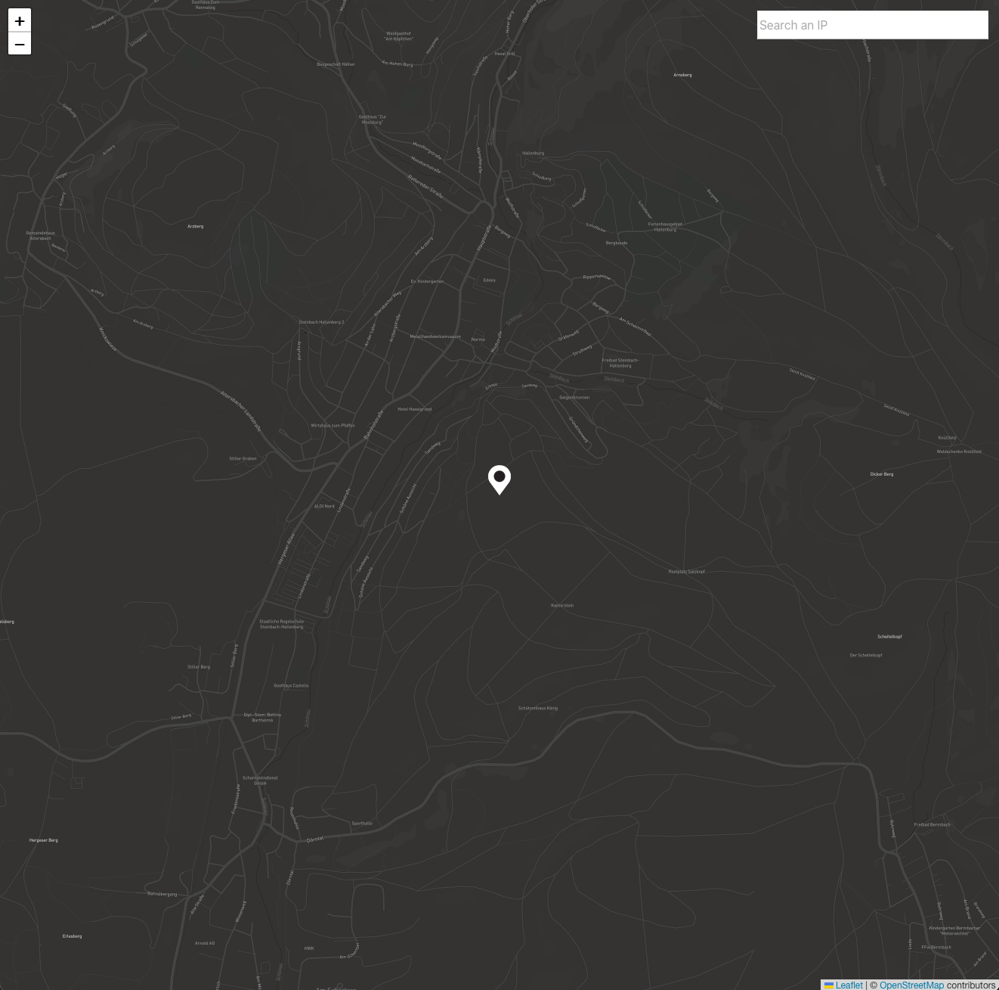

# What's My Ip React App

## Write a React App which relies on multiple APIs

The goal of this project is to write a simple find my IP app in React by utilising different complimentary APIs.

The main functional requirements were to get your IP, geolocate the IP and locate it on a map resource.

The implementation of this website can be viewed [here](https://konstrukteur.github.io/what-is-my-ip-react-app/)

## APIs

- ipapi API [https://ipapi.co](https://ipapi.co)
- public-ip
- leaflet API [https://leafletjs.com](https://leafletjs.com)

## Deployment on GitHub

- gustomize root path to github repository root path in package.json

  - "homepage": "http://{github-username}.github.io/{repo-name}",

- install gh-pages

  - npm install gh-pages --save-dev

- add predeploy and deploy script to package.json. customize the gh-pages deply script

  - "predeploy" : "npm run build",
  - "deploy" : "gh-pages -d build (--remote github)",

- commit and push to github

  - git add .
  - git commit -m "setup gh-pages"
  - git push

- deploy
  - npm run deploy
